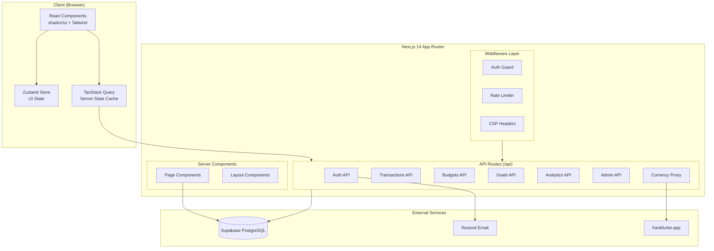
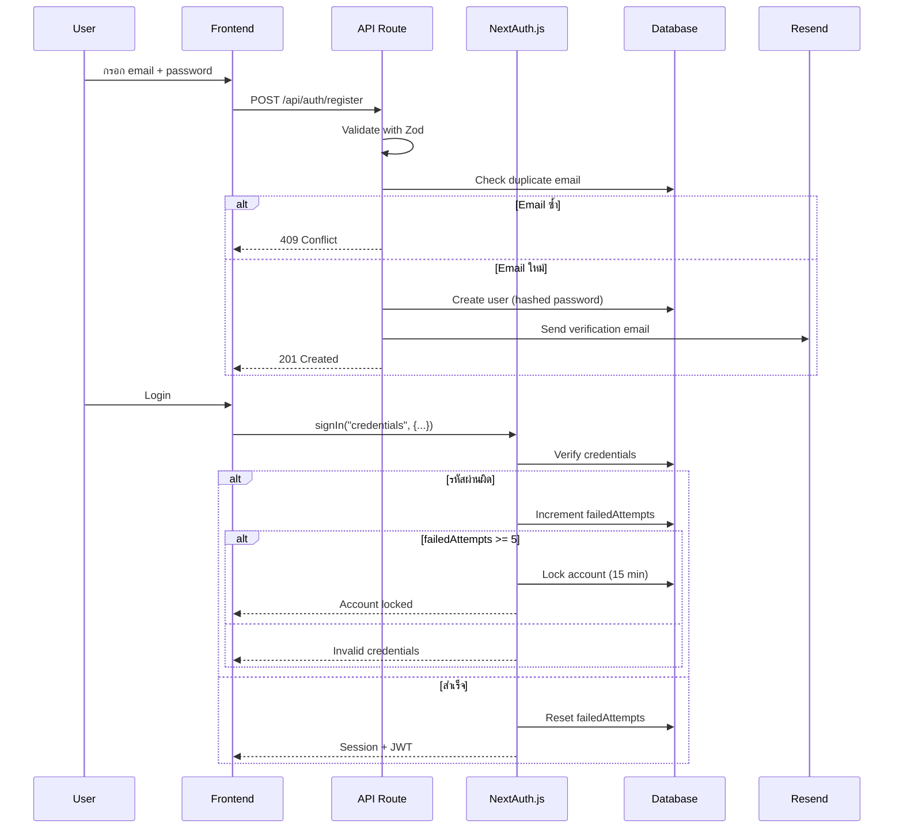
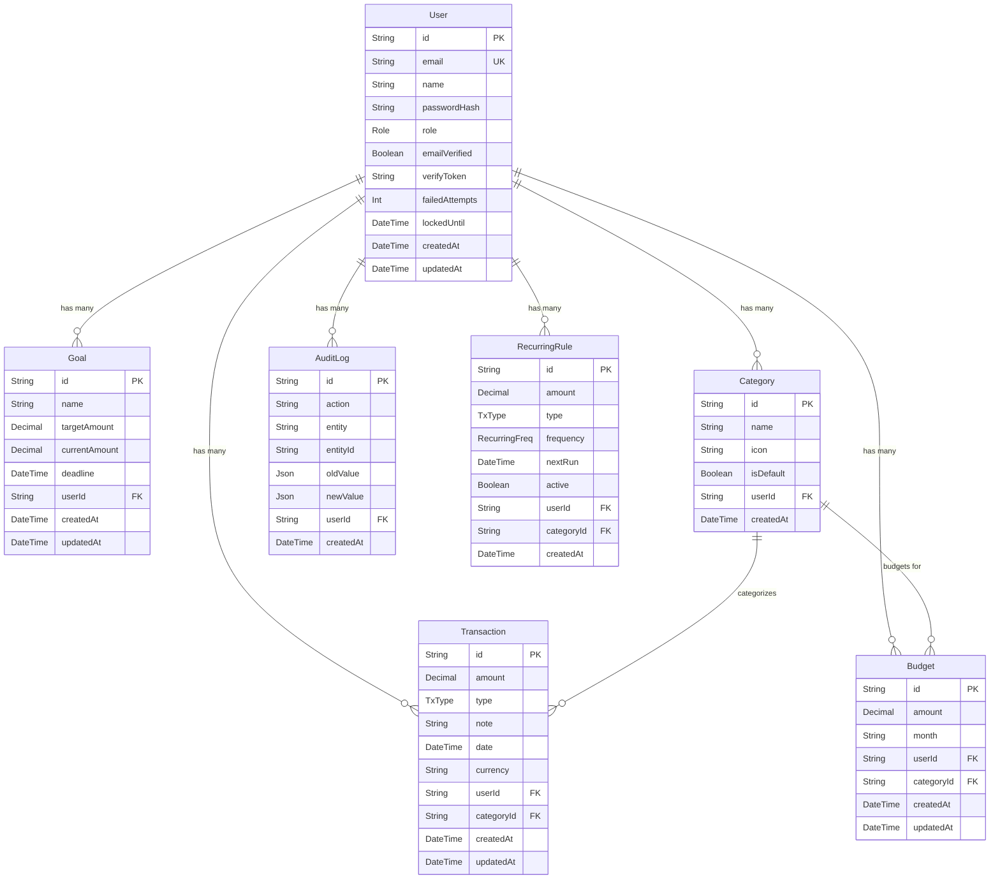

# เอกสารการออกแบบ (Design Document) — SatangLog

## ภาพรวม (Overview)

SatangLog เป็นเว็บแอปพลิเคชันสำหรับบันทึกรายรับรายจ่ายส่วนบุคคล พร้อมระบบวิเคราะห์ข้อมูลทางการเงินจากหลายมุมมอง สร้างด้วย Next.js 14 (App Router), TypeScript, Tailwind CSS, shadcn/ui, Prisma ORM และ Supabase (PostgreSQL) โดยมีระบบ Authentication ผ่าน NextAuth.js v5, ส่งอีเมลผ่าน Resend และดึงอัตราแลกเปลี่ยนจาก frankfurter.app

### เป้าหมายหลัก
- ให้ผู้ใช้บันทึกรายรับรายจ่ายได้สะดวกรวดเร็ว
- แสดง Dashboard ภาพรวมทางการเงินแบบ real-time
- วิเคราะห์ข้อมูลตามหมวดหมู่ แนวโน้ม และเปรียบเทียบช่วงเวลา
- รองรับการนำเข้า/ส่งออกข้อมูล CSV (round-trip)
- รองรับ Responsive Design ตั้งแต่ 320px ถึง 1920px
- มีระบบ Admin สำหรับจัดการผู้ใช้และตรวจสอบ anomaly

### Technology Stack

| Layer | Technology |
|-------|-----------|
| Framework | Next.js 14 (App Router) |
| Language | TypeScript (strict mode) |
| Styling | Tailwind CSS + shadcn/ui |
| ORM | Prisma |
| Database | Supabase (PostgreSQL) |
| Authentication | NextAuth.js v5 (Credentials + OAuth) |
| Email | Resend |
| Exchange Rates | frankfurter.app |
| State Management | Zustand (UI state) + TanStack Query (server state) |
| Charts | Recharts |
| Validation | Zod |
| Testing | Vitest + fast-check (property-based testing) |

---

## สถาปัตยกรรม (Architecture)

### System Architecture Diagram



### Folder Structure

```
src/
├── app/
│   ├── (auth)/
│   │   ├── login/page.tsx
│   │   ├── register/page.tsx
│   │   └── verify-email/page.tsx
│   ├── (dashboard)/
│   │   ├── layout.tsx              # Sidebar + Header
│   │   ├── page.tsx                # Dashboard หน้าหลัก
│   │   ├── transactions/
│   │   │   ├── page.tsx            # รายการ Transaction
│   │   │   └── [id]/page.tsx       # รายละเอียด Transaction
│   │   ├── budgets/page.tsx
│   │   ├── goals/page.tsx
│   │   ├── analytics/
│   │   │   ├── page.tsx            # ภาพรวม Analytics
│   │   │   ├── categories/page.tsx # วิเคราะห์ตามหมวดหมู่
│   │   │   ├── trends/page.tsx     # แนวโน้มตามช่วงเวลา
│   │   │   └── compare/page.tsx    # เปรียบเทียบช่วงเวลา
│   │   ├── import/page.tsx
│   │   └── settings/page.tsx
│   ├── admin/
│   │   ├── layout.tsx
│   │   ├── page.tsx                # Admin Dashboard
│   │   ├── users/page.tsx
│   │   └── transactions/page.tsx
│   ├── api/
│   │   ├── auth/[...nextauth]/route.ts
│   │   ├── transactions/
│   │   │   ├── route.ts            # GET (list), POST (create)
│   │   │   ├── [id]/route.ts       # GET, PUT, DELETE
│   │   │   └── bulk/route.ts       # DELETE (bulk)
│   │   ├── budgets/
│   │   │   ├── route.ts
│   │   │   ├── [id]/route.ts
│   │   │   └── copy/route.ts
│   │   ├── goals/
│   │   │   ├── route.ts
│   │   │   ├── [id]/route.ts
│   │   │   └── [id]/contribute/route.ts
│   │   ├── categories/
│   │   │   └── route.ts            # GET, POST, PUT, DELETE
│   │   ├── analytics/
│   │   │   ├── summary/route.ts
│   │   │   ├── by-category/route.ts
│   │   │   ├── trends/route.ts
│   │   │   ├── compare/route.ts
│   │   │   └── forecast/route.ts
│   │   ├── import/route.ts
│   │   ├── export/route.ts
│   │   ├── currency/route.ts
│   │   └── admin/
│   │       ├── stats/route.ts
│   │       ├── users/route.ts
│   │       └── transactions/route.ts
│   └── layout.tsx                  # Root Layout
├── components/
│   ├── ui/                         # shadcn/ui components
│   ├── forms/
│   │   ├── TransactionForm.tsx
│   │   ├── BudgetForm.tsx
│   │   ├── GoalForm.tsx
│   │   └── CategoryForm.tsx
│   ├── charts/
│   │   ├── BarChart.tsx
│   │   ├── PieChart.tsx
│   │   ├── LineChart.tsx
│   │   └── CompareChart.tsx
│   ├── dashboard/
│   │   ├── SummaryCards.tsx
│   │   ├── RecentTransactions.tsx
│   │   └── MonthlyChart.tsx
│   ├── layout/
│   │   ├── Sidebar.tsx
│   │   ├── Header.tsx
│   │   └── MobileNav.tsx
│   └── shared/
│       ├── DataTable.tsx
│       ├── DateRangePicker.tsx
│       ├── ConfirmDialog.tsx
│       └── FileUpload.tsx
├── lib/
│   ├── auth.ts                     # NextAuth config
│   ├── prisma.ts                   # Prisma client singleton
│   ├── validators/
│   │   ├── transaction.ts          # Zod schemas
│   │   ├── budget.ts
│   │   ├── goal.ts
│   │   ├── category.ts
│   │   └── auth.ts
│   ├── services/
│   │   ├── transaction.service.ts
│   │   ├── budget.service.ts
│   │   ├── goal.service.ts
│   │   ├── category.service.ts
│   │   ├── analytics.service.ts
│   │   └── admin.service.ts
│   ├── csv/
│   │   ├── parser.ts               # CSV Parser
│   │   └── printer.ts              # CSV Pretty Printer
│   ├── analytics/
│   │   ├── forecast.ts             # Linear regression
│   │   └── anomaly.ts              # Anomaly detection
│   └── utils/
│       ├── currency.ts
│       ├── date.ts
│       └── format.ts
├── hooks/
│   ├── useTransactions.ts
│   ├── useBudgets.ts
│   ├── useGoals.ts
│   ├── useAnalytics.ts
│   └── useCategories.ts
├── stores/
│   ├── ui.store.ts                 # Sidebar, theme, modals
│   └── filter.store.ts             # Filter/search state
├── types/
│   └── index.ts                    # Shared TypeScript types
└── prisma/
    ├── schema.prisma
    ├── seed.ts
    └── migrations/
```

### Design Decisions & Rationale

1. **Next.js 14 App Router**: ใช้ Server Components สำหรับ data fetching ลด client-side JavaScript, Route Groups สำหรับแยก layout ระหว่าง auth กับ dashboard
2. **Prisma + Supabase**: Prisma ให้ type-safe database access, Supabase ให้ managed PostgreSQL ที่ scale ได้ง่าย
3. **Zustand + TanStack Query**: แยก UI state (sidebar, modals) ออกจาก server state (transactions, budgets) เพื่อ separation of concerns
4. **Zod Validation**: ใช้ทั้ง client-side และ server-side validation ด้วย schema เดียวกัน ลด duplication
5. **CSV Parser/Printer แยกเป็น pure functions**: เพื่อให้ test ได้ง่ายด้วย property-based testing (round-trip)

---

## คอมโพเนนต์และอินเทอร์เฟซ (Components and Interfaces)

### Server Components vs Client Components

| Component Type | ตัวอย่าง | เหตุผล |
|---------------|---------|--------|
| Server Component | Dashboard Page, Analytics Pages | Data fetching จาก DB โดยตรง, ลด bundle size |
| Client Component | TransactionForm, Charts, DataTable | ต้องการ interactivity, state management |
| Shared Component | ConfirmDialog, DateRangePicker | Reusable UI components |

### API Design

#### Authentication API

```
POST /api/auth/register
  Body: { email, password, name }
  Response: { user } | { error }

POST /api/auth/[...nextauth]
  NextAuth.js handles login/logout/session

POST /api/auth/verify-email
  Body: { token }
  Response: { success } | { error }
```

#### Transactions API

```
GET    /api/transactions?page=1&limit=20&type=INCOME&category=xxx&from=date&to=date&search=keyword
POST   /api/transactions          Body: TransactionCreateInput
GET    /api/transactions/:id
PUT    /api/transactions/:id      Body: TransactionUpdateInput
DELETE /api/transactions/:id
DELETE /api/transactions/bulk      Body: { ids: string[] }
```

#### Budgets API

```
GET    /api/budgets?month=2024-01
POST   /api/budgets               Body: BudgetCreateInput
PUT    /api/budgets/:id            Body: BudgetUpdateInput
DELETE /api/budgets/:id
POST   /api/budgets/copy           Body: { sourceMonth, targetMonth }
```

#### Goals API

```
GET    /api/goals
POST   /api/goals                  Body: GoalCreateInput
PUT    /api/goals/:id              Body: GoalUpdateInput
DELETE /api/goals/:id
POST   /api/goals/:id/contribute   Body: { amount }
```

#### Analytics API

```
GET /api/analytics/summary?from=date&to=date
  Response: { totalIncome, totalExpense, balance, transactionCount }

GET /api/analytics/by-category?from=date&to=date&type=EXPENSE
  Response: { categories: [{ name, total, percentage, changeFromLastMonth }] }

GET /api/analytics/trends?period=monthly|weekly&months=12
  Response: { data: [{ period, income, expense, balance }], averages }

GET /api/analytics/compare?month1=2024-01&month2=2024-02
  Response: { month1, month2, changes: { income, expense, byCategory } }

GET /api/analytics/forecast?months=3
  Response: { predictions: [{ month, predictedIncome, predictedExpense }] }
```

#### Import/Export API

```
POST /api/import
  Body: FormData (CSV file)
  Response: { imported: number, errors: [{ row, message }] }

GET /api/export?from=date&to=date&format=csv
  Response: CSV file download
```

#### Categories API

```
GET    /api/categories
POST   /api/categories             Body: { name, icon }
PUT    /api/categories/:id         Body: { name, icon }
DELETE /api/categories/:id
```

#### Admin API

```
GET /api/admin/stats
  Response: { totalUsers, totalTransactions, activeUsers, anomalies }

GET /api/admin/users?page=1&limit=20
PUT /api/admin/users/:id           Body: { role, isLocked }

GET /api/admin/transactions?page=1&limit=20&userId=xxx
```

### Component Interfaces

#### TransactionForm

```typescript
interface TransactionFormProps {
  mode: 'create' | 'edit';
  initialData?: Transaction;
  onSubmit: (data: TransactionCreateInput | TransactionUpdateInput) => Promise<void>;
  onCancel: () => void;
}
```

#### SummaryCards

```typescript
interface SummaryCardsProps {
  totalIncome: number;
  totalExpense: number;
  balance: number;
  period: string;
  comparedToPrevious?: {
    incomeChange: number;
    expenseChange: number;
  };
}
```

#### DataTable (Generic)

```typescript
interface DataTableProps<T> {
  data: T[];
  columns: ColumnDef<T>[];
  pagination?: { page: number; pageSize: number; total: number };
  onSort?: (column: string, direction: 'asc' | 'desc') => void;
  onFilter?: (filters: Record<string, unknown>) => void;
  onRowClick?: (row: T) => void;
  isLoading?: boolean;
}
```

### Security Design

#### Authentication Flow



#### Middleware Stack

```typescript
// middleware.ts
// 1. Rate Limiting: 100 requests/minute per IP
// 2. Auth Guard: Protect /dashboard/*, /api/* (except /api/auth)
// 3. Role Guard: Protect /admin/* (ADMIN role only)
// 4. CSP Headers: Prevent XSS, clickjacking
```

#### API Route Pattern

```typescript
// ทุก API route ใช้ pattern เดียวกัน:
// 1. Auth check (getServerSession)
// 2. Input validation (Zod)
// 3. Authorization check (ownership/role)
// 4. Business logic
// 5. Audit logging (for sensitive operations)
// 6. Response
```

### Zod Validation Schemas

```typescript
// lib/validators/transaction.ts
const transactionCreateSchema = z.object({
  amount: z.number().positive("จำนวนเงินต้องมากกว่าศูนย์"),
  type: z.enum(["INCOME", "EXPENSE"]),
  categoryId: z.string().uuid().optional(),
  date: z.string().datetime(),
  note: z.string().max(500).optional(),
  currency: z.string().length(3).default("THB"),
});

// lib/validators/budget.ts
const budgetCreateSchema = z.object({
  categoryId: z.string().uuid(),
  amount: z.number().positive(),
  month: z.string().regex(/^\d{4}-\d{2}$/),
});

// lib/validators/goal.ts
const goalCreateSchema = z.object({
  name: z.string().min(1).max(100),
  targetAmount: z.number().positive(),
  deadline: z.string().datetime().optional(),
});

// lib/validators/auth.ts
const registerSchema = z.object({
  email: z.string().email("รูปแบบอีเมลไม่ถูกต้อง"),
  password: z.string()
    .min(8, "รหัสผ่านต้องมีอย่างน้อย 8 ตัวอักษร")
    .regex(/[A-Z]/, "ต้องมีตัวพิมพ์ใหญ่อย่างน้อย 1 ตัว")
    .regex(/[0-9]/, "ต้องมีตัวเลขอย่างน้อย 1 ตัว"),
  name: z.string().min(1).max(100),
});
```

---

## โมเดลข้อมูล (Data Models)

### Prisma Schema



### Prisma Schema Definition

```prisma
enum Role {
  USER
  ADMIN
}

enum TxType {
  INCOME
  EXPENSE
}

enum RecurringFreq {
  DAILY
  WEEKLY
  MONTHLY
  YEARLY
}

model User {
  id              String    @id @default(cuid())
  email           String    @unique
  name            String
  passwordHash    String
  role            Role      @default(USER)
  emailVerified   Boolean   @default(false)
  verifyToken     String?
  failedAttempts  Int       @default(0)
  lockedUntil     DateTime?
  createdAt       DateTime  @default(now())
  updatedAt       DateTime  @updatedAt

  transactions    Transaction[]
  budgets         Budget[]
  goals           Goal[]
  categories      Category[]
  recurringRules  RecurringRule[]
  auditLogs       AuditLog[]
}

model Transaction {
  id          String   @id @default(cuid())
  amount      Decimal  @db.Decimal(12, 2)
  type        TxType
  note        String?
  date        DateTime
  currency    String   @default("THB")
  userId      String
  categoryId  String?
  createdAt   DateTime @default(now())
  updatedAt   DateTime @updatedAt

  user        User     @relation(fields: [userId], references: [id])
  category    Category? @relation(fields: [categoryId], references: [id])

  @@index([userId, date])
  @@index([userId, type])
  @@index([userId, categoryId])
}

model Category {
  id          String   @id @default(cuid())
  name        String
  icon        String   @default("📁")
  isDefault   Boolean  @default(false)
  userId      String
  createdAt   DateTime @default(now())

  user         User          @relation(fields: [userId], references: [id])
  transactions Transaction[]
  budgets      Budget[]

  @@unique([userId, name])
}

model Budget {
  id          String   @id @default(cuid())
  amount      Decimal  @db.Decimal(12, 2)
  month       String   // format: "2024-01"
  userId      String
  categoryId  String
  createdAt   DateTime @default(now())
  updatedAt   DateTime @updatedAt

  user        User     @relation(fields: [userId], references: [id])
  category    Category @relation(fields: [categoryId], references: [id])

  @@unique([userId, categoryId, month])
}

model Goal {
  id            String    @id @default(cuid())
  name          String
  targetAmount  Decimal   @db.Decimal(12, 2)
  currentAmount Decimal   @default(0) @db.Decimal(12, 2)
  deadline      DateTime?
  userId        String
  createdAt     DateTime  @default(now())
  updatedAt     DateTime  @updatedAt

  user          User      @relation(fields: [userId], references: [id])
}

model RecurringRule {
  id          String         @id @default(cuid())
  amount      Decimal        @db.Decimal(12, 2)
  type        TxType
  frequency   RecurringFreq
  nextRun     DateTime
  active      Boolean        @default(true)
  userId      String
  categoryId  String?
  createdAt   DateTime       @default(now())

  user        User           @relation(fields: [userId], references: [id])
}

model AuditLog {
  id        String   @id @default(cuid())
  action    String   // "CREATE", "UPDATE", "DELETE"
  entity    String   // "Transaction", "Budget", etc.
  entityId  String
  oldValue  Json?
  newValue  Json?
  userId    String
  createdAt DateTime @default(now())

  user      User     @relation(fields: [userId], references: [id])

  @@index([userId, createdAt])
  @@index([entity, entityId])
}
```

### Analytics Algorithm Design

#### Linear Regression สำหรับ Forecasting

```typescript
// lib/analytics/forecast.ts
interface DataPoint {
  x: number; // month index (0, 1, 2, ...)
  y: number; // amount
}

function linearRegression(points: DataPoint[]): { slope: number; intercept: number } {
  const n = points.length;
  const sumX = points.reduce((s, p) => s + p.x, 0);
  const sumY = points.reduce((s, p) => s + p.y, 0);
  const sumXY = points.reduce((s, p) => s + p.x * p.y, 0);
  const sumX2 = points.reduce((s, p) => s + p.x * p.x, 0);

  const slope = (n * sumXY - sumX * sumY) / (n * sumX2 - sumX * sumX);
  const intercept = (sumY - slope * sumX) / n;

  return { slope, intercept };
}

function forecast(historicalData: DataPoint[], monthsAhead: number): number[] {
  const { slope, intercept } = linearRegression(historicalData);
  const lastX = historicalData[historicalData.length - 1].x;

  return Array.from({ length: monthsAhead }, (_, i) => {
    const predicted = slope * (lastX + i + 1) + intercept;
    return Math.max(0, predicted); // ไม่ให้ติดลบ
  });
}
```

#### Anomaly Detection สำหรับ Admin

```typescript
// lib/analytics/anomaly.ts
function detectAnomalies(
  transactions: Transaction[],
  threshold: number = 2 // standard deviations
): Transaction[] {
  const amounts = transactions.map(t => Number(t.amount));
  const mean = amounts.reduce((s, a) => s + a, 0) / amounts.length;
  const stdDev = Math.sqrt(
    amounts.reduce((s, a) => s + Math.pow(a - mean, 2), 0) / amounts.length
  );

  return transactions.filter(t => {
    const zScore = Math.abs((Number(t.amount) - mean) / stdDev);
    return zScore > threshold;
  });
}
```

### CSV Parser/Printer Design

```typescript
// lib/csv/parser.ts
interface ParseResult {
  transactions: TransactionCreateInput[];
  errors: { row: number; message: string }[];
}

function parseCSV(content: string): ParseResult {
  // 1. Split lines, parse header
  // 2. Validate each row against expected columns
  // 3. Transform to TransactionCreateInput
  // 4. Collect errors with row numbers
  // Return { transactions, errors }
}

// lib/csv/printer.ts
function printCSV(transactions: Transaction[]): string {
  // 1. Generate header row
  // 2. Format each transaction as CSV row
  // 3. Handle special characters (quoting, escaping)
  // Return CSV string
}
```

### Seed Data Plan

ระบบจะมี seed data สำหรับ development:
- **3 Users**: 1 Admin (admin@satanglog.app), 2 Regular users
- **Default Categories**: อาหาร, ค่าเดินทาง, ที่พัก, เงินเดือน, รายได้เสริม, อื่นๆ
- **Transactions**: ~50 รายการต่อ user (ย้อนหลัง 6 เดือน)
- **Budgets**: 3-5 budgets ต่อ user
- **Goals**: 1-2 goals ต่อ user
- **AuditLogs**: ตัวอย่าง audit entries

### Environment Variables

```
# Database
DATABASE_URL=postgresql://...@supabase.co:5432/postgres
DIRECT_URL=postgresql://...@supabase.co:5432/postgres

# NextAuth
NEXTAUTH_URL=http://localhost:3000
NEXTAUTH_SECRET=...

# Resend
RESEND_API_KEY=re_...

# App
NEXT_PUBLIC_APP_NAME=SatangLog
NEXT_PUBLIC_DEFAULT_CURRENCY=THB
```

---
